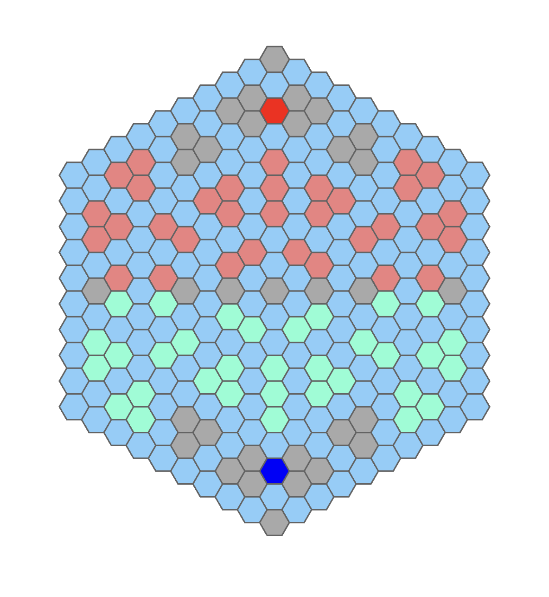

antwar.coord
============================================

本游戏采用六边形地图，EvenQ/Offset模式坐标系，关于六边形地图的更多资料，请见 `redblobgames网站 <https://www.redblobgames.com/grids/hexagons/>`_ 。
我们定义地图最左上角为 ``(0, 0)`` ，整个地图是距离 ``(9, 9)`` 点距离不超过9的所有点的集合。

地图还区分了各类区域，如下图中：

- 红色点为玩家0的主基地，蓝色点为玩家1的主基地
- 浅红色点为玩家0拥有的高台，青色点为玩家1拥有的高台
- 灰色点为无法建造防御塔的高台
- 淡蓝色点（包括两个主基地）是蚂蚁可以行动的区域

具体的坐标列表在游戏文档中列出，SDK也给了各类方便的判断函数，也给了一个描述地图所用的flagmap供各位参考。

.. automodule:: antwar.coord
    :members:
    :undoc-members:
